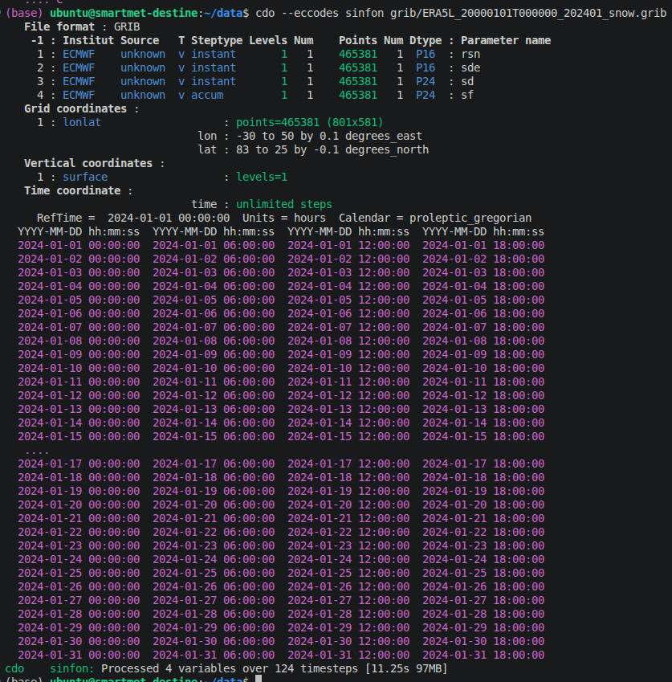

# SmartMet server configuration instructions

## Parameter mapping 

### Inspecting GRIB files 

Check out the contents of grib files with two below commands: 

`cdo --eccodes sinfon name_of_file.grib`  # parameter names

`cdo --eccodes sinfo name_of_file.grib` # parameter IDs

Figure 1 shows example output. We see parameter shortnames, grid coordinates, vertical coordinates and time coordinates, among other information. For parameter mappings, we are interested in Parameter name. Replacing `sinfon` with `sinfo` would produce otherwise similar output, but instead with Parameter IDs:

- rsn : 33.128
- sde : 11.1.0
- sd : 141.128
- sf : 144.128

From this we see that sde is GRIB2, and others are GRIB1 (3 identifiers vs 2). From the ECMWF Parameter database https://codes.ecmwf.int/grib/param-db/ you'll find more information on these variables by searching the shortname. For example, rsn is Snow density [kg m-3] with ID 33: https://codes.ecmwf.int/grib/param-db/?search=rsn. The GRIB encoding for GRIB1 and GRIB2 can also be checked from Parameter database. 

We will need this information for parameter mappings. If not all parameters from grib file are visible at SmartMet server's grid-gui, you need to define new mappings.

Figure 1. 

### FMI parameter definitions 

Good job, you have found a variable not yet configured to SmartMet server!

We start with FMI parameter definitions. All configuration files for parameter mappings are in path `~/config/libraries/grid-files/`. Files for new configurations are in `~/config/libraries/grid-files/ext/` - it is super important to define new mappings under `ext/` directory so that they will not be overridden!! 

The file we are interested in is `fmi_parameters.csv` - identical filename in both working directories. First check if `~/config/libraries/grid-files/fmi_parameters.csv` already has definition for the new parameter (search by name, not shortname). For example, rsn is already mapped there and you should find a row: 

`1035;SND-KGM3;kg m-2;Snow density in kg/m3;1;1;1;;`

In case you can't find your variable, define a new row in `~/config/libraries/grid-files/ext/fmi_parameters.csv`. Here example for 10m U-component of wind:

`# FIELDS:`

`# 1) FmiParameterId`

`# 2) FmiParameterName`

`# 3) FmiParameterUnits`

`# 4) FmiParameterDescription`

`# 5) AreaInterpolationMethod`

`# 6) TimeInterpolationMethod`

`# 7) LevelInterpolationMethod`

`# 8) DefaultPrecision`

`10000165;U10-MS;m/s;10 metre U wind component;1;1;1;2;`

Here, FmiParameterId is given as 10000000 + parameter ID from https://codes.ecmwf.int/grib/param-db/. For example for 10m U-wind component parameterID is 165 (https://codes.ecmwf.int/grib/param-db/?id=165). FmiParameterName is fmi-name with units, for new parameters you can decide the name (here U10-MS). In theory you could name it to RAINBOW-PONY, but common rule to follow is NAME-UNITS and using descriptive names. 