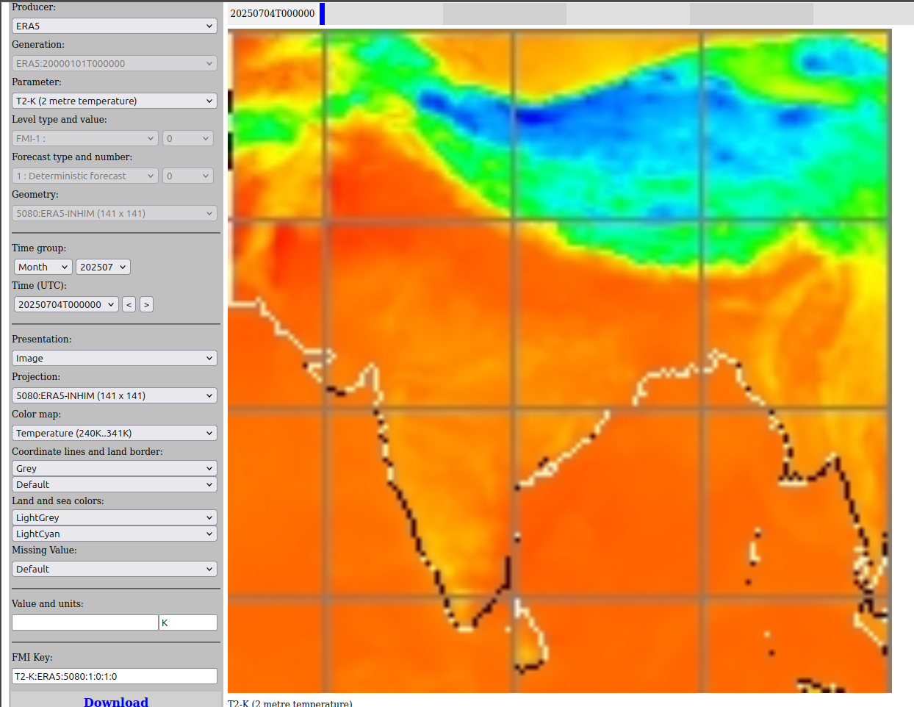
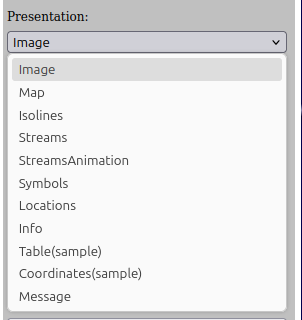

# SmartMet server for CryoSCOPE - Overview

- [SmartMet server - sources and links](#smartmet-server---sources-and-links)
- [What is SmartMet server?](#what-is-smartmet-server)
- [Why SmartMet for CryoSCOPE?](#why-smartmet-for-cryoscope)
- [Grid-GUI interface](#grid-gui-interface)
    - [Producers](#producers)
    - [Generation](#generation)
    - [Parameter](#parameter)
    - [Level type and value](#level-type-and-value)
    - [Forecast type and number](#forecast-type-and-number)
    - [Geometry](#geometry)
    - [Time group and time](#time-group-and-time)
    - [Presentation](#presentation)

## SmartMet server - sources and links

- Main dissemination server: **sm.cryo-scope.eu** 
- Secondary server: firedanger.nsdc.fmi.fi (testing and development)
- General data browser (grid-gui): https://sm.cryo-scope.eu/grid-gui
- NOTE! Server to service data for Europe **desm.harvesterseasons.com** and https://desm.harvesterseasons.com/grid-gui (not to duplicate existing datasets from previous work)
- [The official SmartMet server documentation](https://github.com/fmidev/smartmet-server)

## What is SmartMet server? 
SmartMet server is a data and product server that provides access to observational, forecast, and model data. It is used for data services and product generation. The server can host datasets and products from several producers, e.g. the new datasets and products produced in the CryoSCOPE project. 

Both project’s internal and external users can access and explore the CryoSCOPE datasets via SmartMet server APIs (e.g. Timeseries, WMS, EDR) and the general data browser (grid-gui).

[Timeseries](02_Timeseries.md) to get time series data. 

[WMS](03_WMS.md) for web map layers. 

[EDR](04_EDR.md) for environmental data retrieval. 

The server can read input data from various sources:
- GRIB (1 and 2)
- NetCDF
- SQL database

The server provides several output interfaces:
- WMS 1.3.0
- WFS 2.0
- EDR 1.0
- Several custom interface and several output formats:
- JSON
- XML
- ASCII
- HTML
- SERIAL
- GRIB1
- GRIB2
- NetCDF
- Raster images

## Why SmartMet for CryoSCOPE? 
- Centralized data access
- Standard APIs
- End-user services with Smartmet as the backend data server: simple & efficient
- A cool and powerful tool for many purposes! E.g., machine learning data preparation, showcasing CryoSCOPE data products, services presenting CryoSCOPE data in an accessible and user-friendly format, etc.

## Grid-GUI interface

The general data browsers (grid-gui) can be found from: 
- https://sm.cryo-scope.eu/grid-gui (Figure 1) or
- https://desm.harvesterseasons.com/grid-gui 

The latter one already has a lot of data for European domain. However, main dissemination server for CryoSCOPE will be **sm.cryo-scope.eu**. 

*Figure 1. View of grid-gui interface for [sm.cryo-scope.eu/grid-gui](https://sm.cryo-scope.eu/grid-gui?session=bg=light;bl=1;cl=Grey;cm=None;f=1766;fn=0;ft=1;g=156;gm=5080;hu=128;is=DarkGrey;iv=Generated;k=T2-K:ERA5:5080:1:0:1:0;l=0;lb=Default;lm=LightGrey;lo=None;lt=1;m=3;max=16;mi=Default;min=6;p=T2-K;pg=main;pi=9;pn=ERA5;pre=Image;pro=5080;sa=60;sm=LightCyan;st=10;sy=None;t=20250704T000000;tg=202507;tgt=Month;u=;xx=;yy=;&cm=Temperature%20(240K..341K)).*

From the grid-gui interface user can browse available producers, products (data sets), parameters, and time periods. It is a useful tool for [Timeseries](02_Timeseries.md) requests and other APIs. Let's take a closer look.   

### Producers

*Figure 2. List of producers (available data sets).* 

Figure 2 shows list of producers configured to the server. All producers may not have data on the server (yet). For a list of available producers and data, along with acronyms explained, see [Datasets tables](06_Datasets.md). User can select the producer (product) of interest from this list. 

### Generation

*Figure 3. Available generations for data sets.* 

In some cases, the data is stored in separate generations to avoid overlapping issues. For instance, seasonal forecasts (ECSF, 215-days forecast) are updated monthly and new generation is then created. For [Timeseries](02_Timeseries.md) requests, Generation information is given as the origintime parameter to get the correct data. 

### Parameter

*Figure 4. Available parameters for selected producer.* 

For each producer, there are different sets of available parameters with SmartMet server shortnames and explanations. Note: the shortname syntax is PARAMETER-UNIT but in some cases the actual units differ from the parameter name. Some parameters, like temperatures, are also available in different units (celcius in addition to Kelvins), but those are not shown in grid-gui, unfortunately. Refer to [Datasets tables](06_Datasets.md) for more information. 

### Level type and value

*Figure 5. .* 

### Forecast type and number

*Figure 6. .* 

*Figure 7. .* 

### Geometry 

*Figure 8. .* 

### Time group and time

*Figure 9. .* 

### Presentation

*Figure 10. .* 

