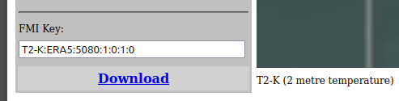

# Timeseries API

- [Timeseries API Overview](#timeseries-api-overview)
- [Example HTTP request](#example-http-request)
- [Locations and areas](#locations-and-areas)
- [Time period](#time-period)
- [Functions](#functions)
    - [Aggregate functions over an area](#aggregate-functions-over-an-area)
    - [Aggregate functions over a time interval](#aggregate-functions-over-a-time-interval)
    - [Mathematical & Unit Change Functions (Grid-Engine Functions)](#mathematical--unit-change-functions-grid-engine-functions)
- [Response formatting](#response-formatting)
- [Available data sets for CryoSCOPE](#available-data-sets-for-cryoscope)

## Timeseries API Overview 

The Timeseries plugin can be used to fetch time series information for observation and forecast data, with specific time or time interval chosen by the user. The datasets can be downloaded with an HTTP request which contains the parameters needed to obtain the information, processing the results and formatting the output. (Note: Examples of Python scripts for the Timeseries API with output in CSV can be found in [Examples](05_Examples.md)).

To see what data is available, check out the general data browsers (grid-gui) at
- https://sm.cryo-scope.eu/grid-gui (CryoSCOPE main dissemination server)
- https://smartmet.xyz/grid-gui (already hosts a lot of European domain data)

and see grid-gui documentation in [SmartMet Overview](00_Overview.md).

For more detailed information, see "the official" [Timeseries API documentation](https://github.com/fmidev/smartmet-plugin-timeseries/tree/master). This document follows the official Timeseries doc, adapted to the CryoSCOPE project. 

## Example HTTP request

A simple example of an HTTP request ([ERA5 dataset in grid-gui](https://sm.cryo-scope.eu/grid-gui?session=bg=light;bl=1;cl=Grey;cm=None;f=;fn=;ft=;g=156;gm=;hu=128;is=DarkGrey;iv=Generated;k=T2-K:ECSF:5081:1:0:1:0;l=;lb=Default;lm=LightGrey;lo=None;lt=;m=0;max=16;mi=Default;min=6;p=;pg=main;pi=9;pn=ERA5;pre=Image;pro=;sa=60;sm=LightCyan;st=10;sy=None;t=;tg=;tgt=Month;u=;xx=;yy=;&p=T2-K)): 

https://sm.cryo-scope.eu/timeseries?latlon=31.3,77.3&param=utctime,latitude,longitude,T2-K:ERA5:5080:1:0:1:0,SUM{T2-K:ERA5:5080:1:0:1:0;-273.5},MUL{RR-M:ERA5:5080:1:0:1:0;1000}&starttime=20250815T000000Z&endtime=20250820T000000Z&hour=12&format=debug&precision=full&tz=utc&timeformat=sql&origintime=20000101T000000Z

*Figure 1. Output for the example http request.*

Let's break it down: 
- The service location (source) that starts the Timeseries HTTP request query is `sm.cryo-scope.eu`, and the parameters following it are given as name-value pairs separated by the ampersand (&) character. (For European data, use `smartmet.xyz`)
- The data is for a point location with latitude 31.3 and longitude 77.3. 
- Parameters requested are utctime, latitude, longitude, 2m temperature in Kelvins, 2m temperature in Celsius, and total precipitation in mm from ERA5 reanalysis dataset. The FMI key for parameters can be copied from https://sm.cryo-scope.eu/grid-gui (or https://smartmet.xyz/grid-gui) (Figure 2). 
- This request uses the Timeseries API’s built-in functions, SUM for summation and MUL for multiplication, to process the data on-the-fly. 
- Data is requested for 5 days 15.8.-20.8.2025 for 12 UTC daily. 
- Output format is debug (Figure 1).

*Figure 2. FMI Key can be copied from grid-gui to Timeseries request.*

## Locations and areas

Timeseries data can be requested for one (latlon, lonlat) or multiple point (latlons,lonlats) locations, or for an area inside a bounding box (bbox). To get data around a given location, user can define the centre location and radius for the circular area from which the data is requested.

|parameter|description|
|:-|:-|
|latlon|The requested geographical location expressed by the latitude and the longitude coordinates `latlon=22.4545,73.111`|
|lonlat|The requested geographical location expressed by the longitude and the latitude coordinates `lonlat=73.111,22.4545`|
|latlons|The list of requested geographical locations expressed by the latitude and the longitude coordinates `latlons=30.0,77.5,31.1,80.1,30.5,79.2`|
|lonlats|The requested geographical location expressed by the longitude and the latitude coordinates `lonlats=77.5,30.0,80.1,31.1,79.2,30.5`|
|bbox|The requested geographical area expressed as the bounding box coordinates `bbox=77.5,30.0,80.1,31.1`. Returns all data points inside that area. Syntax is bbox=minlon,minlat,maxlon,maxlat|

Below are a few additional example queries. 

Data for locations around point with radius of the area 30 km (`latlon=22.4545,73.111:30`), returns data for 4 ERA5 grid points within that area:

https://sm.cryo-scope.eu/timeseries?latlon=22.4545,73.111:30&param=utctime,latitude,longitude,T2-K:ERA5:5080:1:0:1:0&starttime=20250815T000000Z&endtime=20250820T000000Z&hour=00&format=debug&precision=full&tz=utc&timeformat=sql&origintime=20000101T000000Z

Data for 3 locations (`lonlats=77.5,30.0,80.1,31.1,79.2,30.5`):
 
https://sm.cryo-scope.eu/timeseries?lonlats=77.5,30.0,80.1,31.1,79.2,30.5&param=utctime,latitude,longitude,T2-K:ERA5:5080:1:0:1:0&starttime=20250815T000000Z&endtime=20250820T000000Z&hour=00&format=debug&precision=full&tz=utc&timeformat=sql&origintime=20000101T000000Z&grouplocations=1

Data for points within the bounding box (`bbox=77.5,30.0,80.1,31.1`):

https://sm.cryo-scope.eu/timeseries?bbox=77.5,30.0,80.1,31.1&param=utctime,latitude,longitude,T2-K:ERA5:5080:1:0:1:0&starttime=20250815T000000Z&endtime=20250820T000000Z&hour=00&format=debug&precision=full&tz=utc&timeformat=sql&origintime=20000101T000000Z

(There are several other parameters for geographical locations listed in the the official [Timeseries API documentation](https://github.com/fmidev/smartmet-plugin-timeseries/tree/master). Some of them are not valid for CryoScope SmartMet as they would require additional configurations.)

## Time period

There are a few ways to define the desired time period for the Timeseries request, with simplest being `starttime` and `endtime` parameters. These can be formatted f.ex. YYYYMMDDTHHMMSSZ (20250815T130000Z for 15.8.2025 at 13 o'clock). The table below lists alternative ways to define time period. 

|parameter|description|
|:-|:-|
|starttime|The start time of the requested time period.|
|endtime|The end time of the requested time period. If this parameter is missing then the end time is start time plus 24 hours.|
|timestep|The time interval between the requested data. The default value is 1 hour. Value "data" can be used for the "timestep" parameter to select all the exact timesteps available in the data set.|
|timesteps|The number of data records are requested. This is an alternative way to define the end time. Here the end time can be calculated as start time + time steps x time step interval.|
|hour|The requested times are expressed as a list of hours (e.g. "12,13,18,19")|
|time|The requested times are expressed as a list of hours and minutes (e.g. “1200,1230,1315”)|
|tz|The time zone used in the request and the response times. The default value is the special value "localtime", meaning the actual timezone may change for each requested location.|
|origintime|This parameter can be used when requesting forecast information and is used to select a model run based on its origin time. If the parameter is missing the query is executed against the latest data set. In grid-gui, "Generation" refers to the origintime.|

Two additional examples below: 

Starting 15.8.2025 at 00 UTC, data every 2-hours, 5 time steps:

https://sm.cryo-scope.eu/timeseries?latlon=22.4545,73.111:30&param=utctime,latitude,longitude,T2-K:ERA5:5080:1:0:1:0&starttime=20250815T000000Z&timestep=2&timesteps=5&format=debug&precision=full&tz=utc&timeformat=sql&origintime=20000101T000000Z

Seasonal forecast (control run and ensemble member number 15) with origintime `20250801T000000Z` ([ECSF dataset in grid-gui](https://sm.cryo-scope.eu/grid-gui?session=bg=light;bl=1;cl=Grey;cm=None;f=1875;fn=0;ft=1;g=178;gm=5081;hu=128;is=DarkGrey;iv=Generated;k=T2-K:ECSF:5081:1:0:1:0;l=0;lb=Default;lm=LightGrey;lo=None;lt=1;m=4;max=16;mi=Default;min=6;p=T2-K;pg=main;pi=14;pn=ECSF;pre=Table(sample);pro=5081;sa=60;sm=LightCyan;st=10;sy=None;t=20250802T000000;tg=202508;tgt=Month;u=;xx=;yy=;&t=20250802T000000&f=1875&m=4&ft=1&fn=0&pre=Image)):

https://sm.cryo-scope.eu/timeseries?latlon=22.4545,73.111&param=utctime,latitude,longitude,T2-K:ECSF:5081:1:0:1:0,T2-K:ECSF:5081:1:0:3:15&starttime=20250815T000000Z&endtime=20251231T000000Z&hour=00&format=debug&precision=full&tz=utc&timeformat=sql&origintime=20250801T000000Z

`origintime` is important to define especially if dataset has multiple generations (this can be seen in grid-gui from the "Generation" dropdown). For seasonal forecasts, f.ex., new data is always stored in a new generation to avoid overlapping. It is safer to include this parameter to your query always. Refer to [Overview](00_Overview.md) for more information on grid-gui view.     

## Functions 

There are several ready functions available and listed in the official [Timeseries API documentation: Functions](https://github.com/fmidev/smartmet-plugin-timeseries/blob/master/docs/Using-the-Timeseries-API.md#functions), see tables there for all functions. Here below are a few examples. 

### Aggregate functions over an area

Get minimum, maximum and mean ERA5 2m temperatures (K) for area within the bounding box (`bbox=77.5,30.0,80.1,31.1`), and rename variables:

[https://sm.cryo-scope.eu/timeseries?bbox=77.5,30.0,80.1,31.1&param=utctime,latitude,longitude,min(T2-K:ERA5:5080:1:0:1:0) as mintemp,max(T2-K:ERA5:5080:1:0:1:0) as maxtemp&starttime=20250815T000000Z&endtime=20250820T000000Z&hour=00&format=debug&precision=full&tz=utc&timeformat=sql&origintime=20000101T000000Z](https://sm.cryo-scope.eu/timeseries?bbox=77.5,30.0,80.1,31.1&param=utctime,name,min(T2-K:ERA5:5080:1:0:1:0)%20as%20mintemp,max(T2-K:ERA5:5080:1:0:1:0)%20as%20maxtemp,mean(T2-K:ERA5:5080:1:0:1:0)%20as%20meantemp&starttime=20250815T000000Z&endtime=20250820T000000Z&hour=00&format=debug&precision=full&tz=utc&timeformat=sql&origintime=20000101T000000Z)

### Aggregate functions over a time interval

Get maximum and minimum daily (24h) 2m temperatures for previous day, and rename variables. Syntax is (variable/btime/atime) where 'btime' is the time before the time step and 'atime' is the time after the time step.  

[https://sm.cryo-scope.eu/timeseries?latlon=22.4545,73.111&param=time,latitude,longitude,max_t(T2-K:ERA5:5080:1:0:1:0/24h/0h)%20as%20dailymaxtemp,min_t(T2-K:ERA5:5080:1:0:1:0/24h/0h)%20as%20dailymintemp&starttime=20250815T000000Z&hour=0&endtime=20250830T000000&format=debug&precision=full&tz=utc&timeformat=sql&origintime=20000101T000000Z](https://sm.cryo-scope.eu/timeseries?latlon=22.4545,73.111&param=time,latitude,longitude,max_t(T2-K:ERA5:5080:1:0:1:0/24h/0h)%20as%20dailymaxtemp,min_t(T2-K:ERA5:5080:1:0:1:0/24h/0h)%20as%20dailymintemp&starttime=20250815T000000Z&hour=0&endtime=20250830T000000&format=debug&precision=full&tz=utc&timeformat=sql&origintime=20000101T000000Z)

Similar functions for summation, mean, etc. You can also filter data by adding brackets f.ex. `max_t[0:](variable/btime/atime)` to filter only values above zero or `max_t[0:20](variable/btime/atime)` to have only values between zero and 20.

### Mathematical & Unit Change Functions (Grid-Engine Functions)

There are several build-in functions available written with C++, listed in the official SmartMet server [Timeseries API documentation: Functions](https://github.com/fmidev/smartmet-plugin-timeseries/blob/master/docs/Using-the-Timeseries-API.md#functions) under the Grid-Engine Functions. One example here is to add -273.15 to temperature to convert from Kelvins to Celsius, or use K2C for same unit conversion directly. 

[https://sm.cryo-scope.eu/timeseries?latlon=22.4545,73.111&param=time,latitude,longitude,T2-K:ERA5:5080:1:0:1:0,SUM{T2-K:ERA5:5080:1:0:1:0;-273.15},K2C{T2-K:ERA5:5080:1:0:1:0}&starttime=20250815T000000Z&hour=0&endtime=20250830T000000&format=debug&precision=full&tz=utc&timeformat=sql&origintime=20000101T000000Z](https://sm.cryo-scope.eu/timeseries?latlon=22.4545,73.111&param=time,latitude,longitude,T2-K:ERA5:5080:1:0:1:0,SUM{T2-K:ERA5:5080:1:0:1:0;-273.15},K2C{T2-K:ERA5:5080:1:0:1:0}&starttime=20250815T000000Z&hour=0&endtime=20250830T000000&format=debug&precision=full&tz=utc&timeformat=sql&origintime=20000101T000000Z)

## Response formatting

User can decide the `format` of response in the TimeSeries request (the `format` parameter in the query). Available formats include json, debug, ascii, csv, xml, php, serial, html, wxml. 

Examples below for debug and json: 

[https://sm.cryo-scope.eu/timeseries?latlon=22.4545,73.111&param=time,latitude,longitude,T2-K:ERA5:5080:1:0:1:0,SUM{T2-K:ERA5:5080:1:0:1:0;-273.15},K2C{T2-K:ERA5:5080:1:0:1:0}&starttime=20250815T000000Z&hour=0&endtime=20250830T000000&format=debug&precision=full&tz=utc&timeformat=sql&origintime=20000101T000000Z](https://sm.cryo-scope.eu/timeseries?latlon=22.4545,73.111&param=time,latitude,longitude,T2-K:ERA5:5080:1:0:1:0,SUM{T2-K:ERA5:5080:1:0:1:0;-273.15},K2C{T2-K:ERA5:5080:1:0:1:0}&starttime=20250815T000000Z&hour=0&endtime=20250830T000000&format=debug&precision=full&tz=utc&timeformat=sql&origintime=20000101T000000Z)

[https://sm.cryo-scope.eu/timeseries?latlon=22.4545,73.111&param=time,latitude,longitude,T2-K:ERA5:5080:1:0:1:0,SUM{T2-K:ERA5:5080:1:0:1:0;-273.15},K2C{T2-K:ERA5:5080:1:0:1:0}&starttime=20250815T000000Z&hour=0&endtime=20250830T000000&format=json&precision=full&tz=utc&timeformat=sql&origintime=20000101T000000Z](https://sm.cryo-scope.eu/timeseries?latlon=22.4545,73.111&param=time,latitude,longitude,T2-K:ERA5:5080:1:0:1:0,SUM{T2-K:ERA5:5080:1:0:1:0;-273.15},K2C{T2-K:ERA5:5080:1:0:1:0}&starttime=20250815T000000Z&hour=0&endtime=20250830T000000&format=json&precision=full&tz=utc&timeformat=sql&origintime=20000101T000000Z)

See [Examples](05_Examples.md) section for Python scripts for the Timeseries API with response downloaded to a CSV file. Note that if you change `format=csv` to html query, the response csv file will automatically be downloaded. 

## Available data sets for CryoSCOPE

Please refer to [Datasets](06_Datasets.md) for available datasets on CryoSCOPE SmartMet server. 