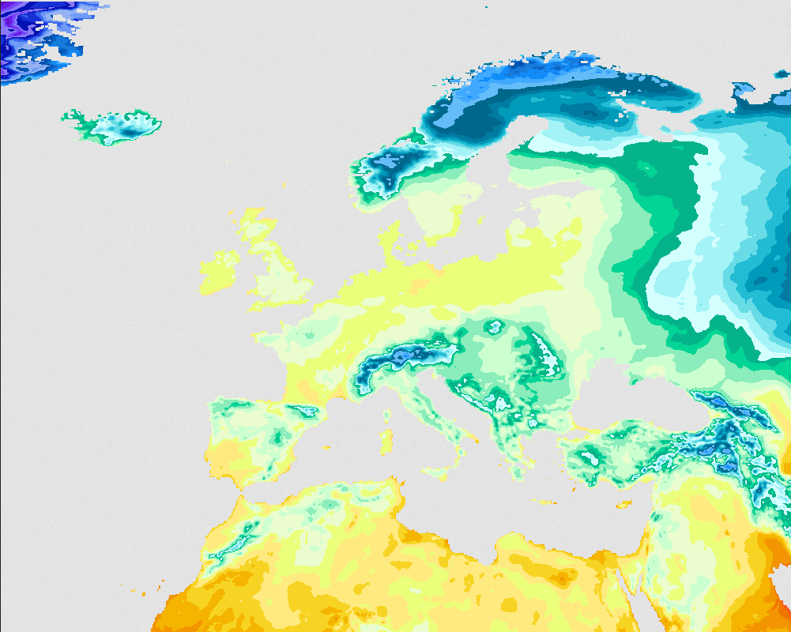

# Web Map Service (WMS)

Map images can be generated using the SmartMet Server Dali engine, which produces visualizations from SmartMet Server internal data. Dali can be used directly through its own HTTP interface or, with appropriate layer definitions, through an OGC-compliant Web Map Service (WMS) interface.

The Open Geospatial Consortium (OGC) Web Map Service (WMS) provides a standardized HTTP interface for requesting georeferenced map images from a map server. The SmartMet Server WMS plugin, powered by Dali, supports OGC WMS version 1.3.0 and allows SmartMet server datasets to be visualized.

Available WMS layers for CryoSCOPE project can be discovered using a `GetCapabilities` request, for example:

https://sm.cryo-scope.eu/wms?SERVICE=WMS&VERSION=1.3.0&REQUEST=GetCapabilities

Upon request, more WMS layers and configurations can be added to CryoSCOPE SmartMet server. 

Relevant links for more information: 
- https://github.com/fmidev/smartmet-plugin-wms
- http://docs.geoserver.org/stable/en/user/services/wms/
- https://www.ogc.org/standards/wms/ 

See also example end-user service utilizing WMS layers [HarvesterSeasons.com](07_HarvesterSeasons.md)

Example request for ERA5-Land 2 metre temperature over Europe (20251211T000000):

https://smartmet.xyz/wms?&SERVICE=WMS&REQUEST=GetMap&VERSION=1.3.0&LAYERS=gui:isobands:ERA5L_T2-K&STYLES=&FORMAT=image/png&TRANSPARENT=true&HEIGHT=800&WIDTH=1000&time=20251211T000000&CRS=EPSG:4326&BBOX=25,-30,75,50

