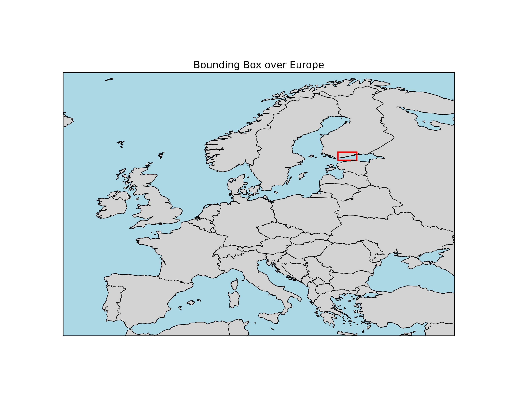

# Examples

This section includes links to python scripts for Timeseries queries. The scripts save data as csv files. More examples will be added upon request (anni.kroger@fmi.fi).

## Links to example scripts
- [Requirements](../xgb2-conda-env.yml)
- [ERA5 for given bounding box (bbox)](../examples/ts-bbox-era5.py)

## ERA5 for given bounding box (bbox)

The Python script to fetch ERA5 reanalysis data for a given bounding box (bbox) [ts-bbox-era5.py](../examples/ts-bbox-era5.py). Results are saved as csv files. 

This script fetches multiple parameters (Table 1) for time period 1.1.2020 00 UTC- 31.12.2022 12 UTC with 12-hour steps for ERA5 data and 24h steps for ERA5 daily statistics (ERA5D). 

*Table 1. List of parameters the script queries.*

|User-defined shortname| SmartMet shortname| Parameter name (units)| Dataset|
|:-|:-|:-|:-|
|u10-ms|U10-MS|10m u-component of wind (m/s)|ERA5|
|v10-ms|V10-MS|10m v-component of wind (m/s)|ERA5|
|t2-K|T2-K|2m temperature (K)|ERA5|
|t2-C|T2-K|2m temperature, converted to celsius from Kelvins (C)|ERA5|
|t850-K|T-K|temperature (K), pressure level 850 hPa|ERA5|
|t700-K|T-K|temperature (K), pressure level 700 hPa|ERA5|
|t500-K|T-K|temperature (K), pressure level 500 hPa|ERA5|
|tp-m|RR-M|Previous day sum Total percipitation (m)|ERA5D|
|tp-mm|RR-M|Previous day sum Total percipitation, converted from m to mm (mm)|ERA5D|
|mx2t-K|TMAX-K|Previous day maximum Maximum temperature (K)|ERA5D|
|mn2t-K|TMIN-K|Previous day minimum Minimum temperature (K)|ERA5D|

The requested are is shown as red rectangle in Figure 1. 

*Figure 1. Bounding box for the Timeseries query (in red).*

As this is for European domain, the source server is *smartmet.xyz*. Each parameter is queried separately, example query this script produces (with format changed to debug here): 

http://smartmet.xyz:8080/timeseries?bbox=23.604126,59.642764,26.251831,60.777937&param=utctime,latitude,longitude,MUL%7bRR-M:ERA5D:5021:1:0:1;1000%7d&starttime=20220101T000000Z&endtime=20221231T120000Z&hour=00&format=debug&precision=full&tz=utc&timeformat=sql&origintime=20000101T000000Z

You could also query all parameters with one request, but for large queries (multiple timesteps, multiple grid points or locations) it is more efficient to request one parameter at a time. 