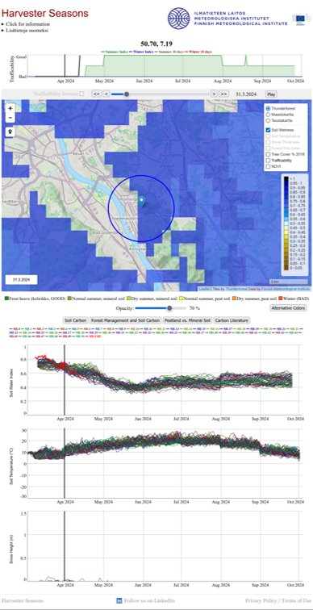
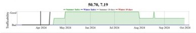
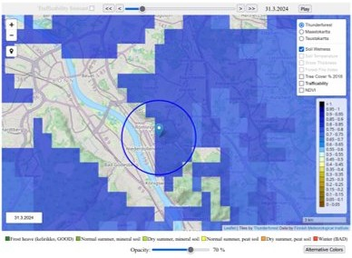
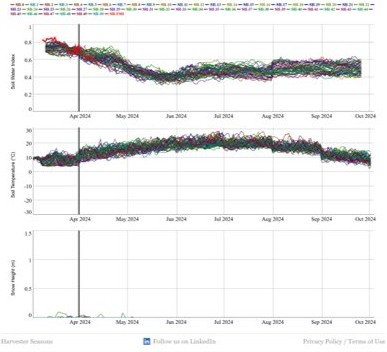

# Example End-User Service: A forestry climate service Harvester Seasons

With SmartMet Server as a backend, it is possible to build end-user services that visualize and demonstrate the data products developed within the CryoSCOPE project.

An example of such a service is [Harvester Seasons](harvesterseasons.com), developed for forestry use cases to support more sustainable forest operations. The service provides vizualisation of satellite data, reanalysis datasets, and forecasts for variables and indices identified together with end-users as most relevant for forestry operations (f.ex. trafficability, soil water index, soil temperature, snow height, etc). A lightweight, JavaScript-based web interface combines these data sources into an interactive visualization and analysis tool. More detailed information of the Harvester Seasons service, click for more information in the web page or contact mikko.strahlendorff@fmi.fi. 

The entire system supporting the service is available in the [harvesterseasons-smartmet](https://github.com/fmidev/harvesterseasons-smartmet) GitHub repository.

The service has three main components: Trafficability index, WMS layers, and Time series graphs. 

Figure 1. View of the Harvester Seasons service. 

(Note: figures here have quite poor quality, updated later!)

### Define own indices with LUA functions

Harvester Seasons shows Trafficability Summer/Winter Index that indicates whether forest terrain is suitable for heavy machinery to operate - with simple Good, Bad, No data states. Here, trafficability refers to vehicle bearing capacity of the ground based on soil and snow conditions. Similarly, other indices can be derived data using f.ex. thresholds implemented in SmartMet Server LUA functions, for the CryoSCOPE project end-user services. 

Figure 2. Trafficability Index

### WMS layers for map vizualisation 

### Time series graphs

